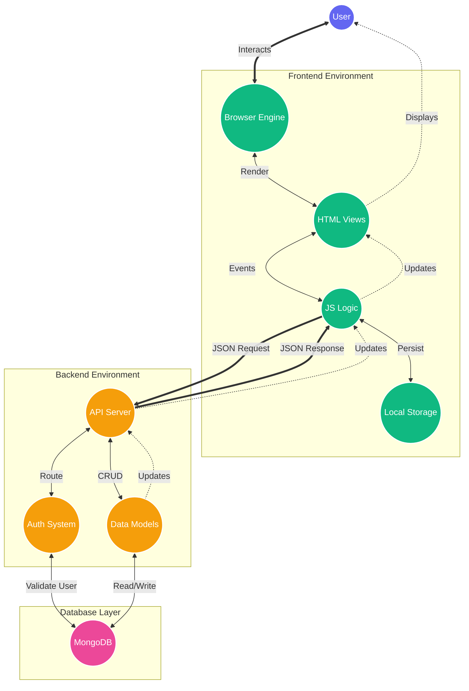

# Smart Finance Advisor - Architecture & Flow

## 1. Interaction Ecosystem (Circular Flow)



## 2. Directory Structure

```text
smart-finance-advisor/
├── backend/                        # Service & Data Layers
│   ├── middleware/
│   │   └── auth.js                 # Authentication verification
│   ├── models/                     # Database Schemas
│   │   ├── Investment.js           # Investment data structure
│   │   ├── Transaction.js          # Transaction data structure
│   │   └── User.js                 # User profile & credentials
│   ├── routes/                     # API Endpoints
│   │   ├── auth.js                 # Login/Register endpoints
│   │   ├── investments.js          # Investment CRUD
│   │   └── transactions.js         # Transaction CRUD
│   └── server.js                   # Application Entry Point
│
├── frontend/                       # Presentation Layer
│   ├── css/                        # Styling
│   │   ├── dashboard.css           # App interface styles
│   │   ├── sections.css           # Sections specific styles (if any)
│   │   └── style.css               # Global theme & layout
│   ├── js/                         # Logic Layer
│   │   ├── auth.js                 # Login/Register handling
│   │   ├── dashboard.js            # Dashboard stats & charts
│   │   ├── insights.js             # Financial analysis
│   │   ├── investments.js          # Investment management
│   │   ├── main.js                 # Shared utilities
│   │   └── transactions.js         # Transaction management
│   ├── dashboard.html              # Main App View
│   ├── goals.html                  # Goal Tracking View
│   ├── index.html                  # Landing Page
│   ├── investments.html            # Investments View
│   ├── login.html                  # Login View
│   ├── profile.html                # User Profile View
│   ├── register.html               # Registration View
│   ├── settings.html               # App Settings View
│   └── transactions.html           # Transactions View
│
├── .env                            # Configuration Secrets
└── package.json                    # Project Dependencies
```

## 3. Data Flow Description

### 3.1. User Interaction Flow
1.  **Entry**: User opens the app. `server.js` serves `index.html`.
2.  **Authentication**:
    *   User goes to `login.html`.
    *   `js/auth.js` captures input.
    *   **Current State**: It saves a mock token to browser `LocalStorage`.
    *   **Target State**: It should send a request to `routes/auth.js`, which checks `models/User.js` and returns a real JWT.
3.  **Dashboard**:
    *   User is redirected to `dashboard.html`.
    *   `js/dashboard.js` reads data.
    *   **Current State**: Reads from `LocalStorage`.
    *   **Target State**: Calls `routes/transactions.js` to get real data from MongoDB.

### 3.2. Technical Stack Map
*   **Presentation**: HTML5, CSS3, Vanilla JS
*   **Service**: Node.js, Express.js
*   **Data**: MongoDB, Mongoose
*   **Security**: JWT (JSON Web Tokens), BCrypt (Password Hashing)
